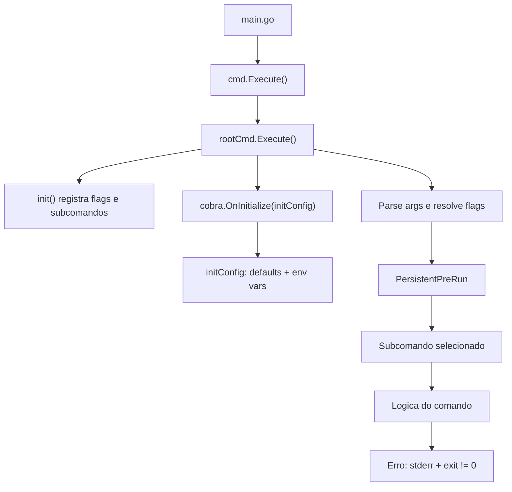

# Fluxo de carregamento e organizacao do pacote cmd

Este documento explica como o binario carrega o Cobra/Viper, como as flags sao processadas e como o pacote `cmd` esta organizado neste projeto.

## Visao geral do fluxo

1. **main.go** chama `cmd.Execute()`.
2. **cmd/root.go** cria o comando raiz (`rootCmd`) e registra subcomandos.
3. O Cobra **parseia os argumentos**, resolve flags e executa o comando selecionado.
4. O Viper **carrega valores de flags e variaveis de ambiente** (quando configurado).
5. O comando selecionado executa sua logica e retorna erros.



Arquivos principais:
- [main.go](main.go)
- [cmd/root.go](cmd/root.go)
- [cmd/create.go](cmd/create.go)
- [cmd/update.go](cmd/update.go)
- [cmd/get.go](cmd/get.go)
- [cmd/describe.go](cmd/describe.go)
- [cmd/delete.go](cmd/delete.go)

## Ponto de entrada

Em [main.go](main.go), a funcao `main()` chama `cmd.Execute()`. Isso delega toda a inicializacao para o pacote `cmd`.

```go
func main() {
    cmd.Execute()
}
```

## root.go: o comando raiz e o registro de subcomandos

Em [cmd/root.go](cmd/root.go), o comando raiz e definido em `rootCmd`:

- `Use`: nome do binario (`projeto_config`)
- `Short`/`Long`: descricao curta e longa
- `Version`: versao exibida com `--version`/`-v`
- `SilenceUsage`: evita exibir help completo quando ocorre erro

A funcao `Execute()` chama `rootCmd.Execute()`, que:
- Analisa `os.Args`
- Resolve flags
- Dispara o comando selecionado
- Retorna erro se algo falhar

```go
func Execute() {
    if err := rootCmd.Execute(); err != nil {
        fmt.Fprintln(os.Stderr, err)
        os.Exit(1)
    }
}
```

## init(): o gancho de inicializacao do Cobra

O Cobra usa `init()` para configurar o CLI antes de `Execute()` rodar. Em [cmd/root.go](cmd/root.go), o `init()`:

1. Registra `initConfig` via `cobra.OnInitialize(initConfig)`
2. Declara flags globais (persistentes)
3. Faz bind das flags no Viper
4. Define `PersistentPreRun` para aplicar configuracao
5. Registra subcomandos

```go
func init() {
    cobra.OnInitialize(initConfig)

    rootCmd.PersistentFlags().String("org-id", defaultOrgID, "ID da organizacao GCP")
    // ... outras flags ...

    _ = viper.BindPFlag("org-id", rootCmd.PersistentFlags().Lookup("org-id"))
    // ... outros binds ...

    rootCmd.PersistentPreRun = func(cmd *cobra.Command, args []string) {
        gcp.SetGCloudCommandSummaryEnabled(viper.GetBool("show-gcloud-commands"))
    }

    rootCmd.AddCommand(newCreateCommand())
    rootCmd.AddCommand(newUpdateCommand())
    rootCmd.AddCommand(newGetCommand())
    rootCmd.AddCommand(newDescribeCommand())
    rootCmd.AddCommand(newDeleteCommand())
}
```

### Flags persistentes (globais)

Flags persistentes sao herdadas por todos os subcomandos. Neste projeto:

- `--org-id`
- `--parent-folder`
- `--billing-account`
- `--show-gcloud-commands`

Essas flags sao declaradas no `rootCmd.PersistentFlags()`.

### Viper e o bind de flags

O Viper permite ler valores de:
- Flags
- Variaveis de ambiente
- Defaults

O `viper.BindPFlag()` conecta uma flag a uma chave do Viper, tornando o valor acessivel com `viper.GetString()` / `viper.GetBool()`.

### PersistentPreRun

Esse hook roda **antes de qualquer subcomando**, e eh ideal para aplicar configuracoes globais.

Aqui ele habilita/desabilita a exibicao de comandos `gcloud` com base no valor de `--show-gcloud-commands`.

## initConfig(): defaults e env vars

Em [cmd/root.go](cmd/root.go), `initConfig()` configura o Viper:

- `SetEnvPrefix("PROJETO_CONFIG")`: prefixo das variaveis de ambiente
- `AutomaticEnv()`: habilita leitura de `PROJETO_CONFIG_*`
- `SetDefault(...)`: define valores padrao se nao houver flag/env

Exemplo de variavel de ambiente:

```bash
PROJETO_CONFIG_ORG_ID=123456789 ./projeto_config get projeto meu-projeto
```

## Como os subcomandos sao organizados

Cada subcomando esta em seu proprio arquivo no pacote `cmd`, seguindo o padrao do Cobra:

- [cmd/create.go](cmd/create.go): `create` e subcomandos
- [cmd/update.go](cmd/update.go): `update`
- [cmd/get.go](cmd/get.go): `get`
- [cmd/describe.go](cmd/describe.go): `describe`
- [cmd/delete.go](cmd/delete.go): `delete`
- [cmd/common.go](cmd/common.go): helpers compartilhados

Em geral, cada arquivo define uma funcao do tipo `newXCommand()` que retorna `*cobra.Command`.

O `rootCmd.AddCommand(...)` registra cada um deles no comando raiz.

## Sobre o comando completion

O Cobra adiciona automaticamente o comando `completion`, que gera scripts de autocompletar para o shell:

```bash
./projeto_config completion bash
./projeto_config completion zsh
./projeto_config completion fish
./projeto_config completion powershell
```

Esse comando **nao precisa de codigo adicional** no projeto. O Cobra injeta esse subcomando automaticamente quando voce usa `rootCmd`.

## Resumo do carregamento (passo a passo)

1. `main()` chama `cmd.Execute()`.
2. `init()` em `cmd/root.go` registra flags e subcomandos.
3. `cobra.OnInitialize(initConfig)` prepara o Viper.
4. `rootCmd.Execute()` analisa args e resolve qual comando executar.
5. `PersistentPreRun` aplica configuracao global.
6. O subcomando executa sua logica.
7. Erros sao enviados para stderr e retornam exit code diferente de zero.

## Dicas para evoluir o CLI

- **Nova flag global**: adicione em `rootCmd.PersistentFlags()` e `viper.BindPFlag()`.
- **Nova variavel de ambiente**: basta usar `SetEnvPrefix` + `AutomaticEnv`.
- **Novo subcomando**: crie `newXCommand()` em `cmd/x.go` e adicione no `init()`.
- **Nova flag local**: use `cmd.Flags()` dentro do subcomando.
